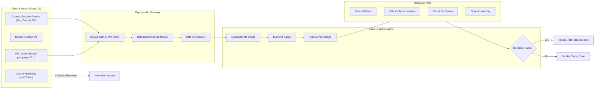

# Smart ERP

A full-stack multi-tenant ERP application built with React 19, Node.js, Express, TypeScript, and MongoDB.

<p align="center">
  
</p>

---

## Overview

I built Smart ERP to handle core operational workflows for manufacturing and distribution businesses. The main architectural focus was implementing multi-tenant and multi-branch data isolation while keeping the UI responsive and straightforward for users who frequently switch between branches and fiscal years.

Every transactional record (Invoices, Bills, Purchase Orders, Store Movements, Delivery Challans) is strictly partitioned across three dimensions:
- **Organisation**: The top-level tenant.
- **Branch**: The physical operating location (e.g., Chennai HQ, Coimbatore Unit, Bengaluru Depot).
- **Financial Year**: Fiscal accounting period (e.g., 2026-2027) with open/closed period controls.

The frontend keeps table filters, search queries, pagination, and sorting synchronized directly with URL query parameters so links can be bookmarked or shared without losing context.

---

## Architecture & Key Features

- **Multi-Tenant & Multi-Branch Scoping**: All queries run through scoping middleware that automatically filters by `organisationId`, `branchId`, and `financialYear`.
- **Financial Year Management**: Supports creating, activating, and closing accounting periods. Closed periods lock transactions against further edits.
- **URL-Synchronized State (`useUrlTableState`)**: Search terms, status filters, sort columns, and pagination are reflected in the URL query string.
- **Clean Empty States**: Switching to a branch or historical year with no data renders an informative empty state with quick-reset buttons rather than breaking the table.
- **HttpOnly Cookie Authentication**: JWTs are stored in secure cookies rather than `localStorage`, mitigating token theft via XSS. `localStorage` only retains non-sensitive UI preferences (current branch name, selected fiscal year).
- **Structured Vector PDF Generation**: Tax invoices are rendered as native vector PDFs via `@react-pdf/renderer`, ensuring crisp typography and consistent margins across print and download.
- **Procurement & Inventory Tracking**:
  - Purchase Orders track remaining quantities per line item when converted to Bills to prevent over-billing.
  - Inward store movements validate batch numbers, warehouse rack/shelf locations, and require expiry dates to be at least 5 days into the future when applicable.
  - Low-stock items trigger auto-reorder drafts pending administrator approval.
- **Banking & Double-Entry Ledger**:
  - Institutional bank accounts with single-primary enforcement.
  - Double-entry ledger tracking debits, credits, running balances, and reversals.
  - Payment modal shared across Invoices, Bills, and PO advances.

---

## Screenshots & Core Workflows

### 1. Authentication
Login supports email or mobile number with password. The backend sets an `authToken` cookie and returns user permissions scoped to authorized branches.


---

### 2. Operational Dashboard
Displays branch revenue, order status distributions, GST tax totals, purchase orders, and inventory reorder alerts scoped to the active branch and fiscal year.


---

### 3. Scoped Sales & Order Records
Interactive data table with real-time search, status filters, date tracking, and GST breakdowns.


---

### 4. Zero-Record State Handling
When a newly opened branch or a closed historical year contains no records, the UI presents an empty state with quick actions to reload or clear filters.


---

### 5. Financial Year Master
Allows administrators to manage accounting periods: create new fiscal years, toggle active periods, designate the current operating year, and lock closed years.


---

### 6. Workspace & Branch Switcher
A slide-over drawer in the header lets users switch tenant organisation, branch, and financial year without navigating away from their current screen.


---

### 7. Notification & Alert Drawer
Slide-over drawer providing categorized operational alerts (orders, billing, low stock, system updates) with direct navigation to the relevant documents.


---

## Request & Scoping Pipeline



---

## Database Models

Core schemas defined in `server/src/models/ErpModels.ts`:

| Model | Key Fields | Multi-Tenant Scope |
| :--- | :--- | :--- |
| **`Organisation`** | `name`, `code`, `currency`, `taxIdentifier` | Root tenant entity |
| **`Branch`** | `organisationId`, `branchCode`, `branchName`, `city`, `address` | Sub-tenant operating location |
| **`FinancialYear`** | `yearName`, `startDate`, `endDate`, `isCurrent`, `status`, `organisationId` | Fiscal accounting periods |
| **`UserAccount`** | `name`, `email`, `mobile`, `passwordHash`, `roles: IUserRole[]` | Multi-branch role assignments |
| **`Customer`** | `name`, `customerCode`, `companyName`, `gstin`, `creditLimit`, `branchId` | Scoped by branch & org |
| **`Vendor`** | `name`, `vendorCode`, `companyName`, `gstin`, `paymentTerms`, `branchId` | Scoped by branch & org |
| **`Product`** | `name`, `itemCode`, `hsnCode`, `unitPrice`, `minReorderLevel`, `isActive` | Scoped by branch & org |
| **`PurchaseOrder`** | `poNumber`, `vendorId`, `branchId`, `financialYear`, `items`, `status` | Scoped by branch, org, & FY |
| **`Bill`** | `billNumber`, `vendorId`, `purchaseOrderId`, `items`, `paidAmount`, `status` | Scoped by branch, org, & FY |
| **`Invoice`** | `invoiceNumber`, `customerId`, `branchId`, `financialYear`, `items`, `status` | Scoped by branch, org, & FY |
| **`StoreItem`** | `productId`, `branchId`, `quantity`, `batchNumber`, `expiryDate` | Scoped by branch & org |
| **`DeliveryChallan`**| `challanNumber`, `invoiceId`, `branchId`, `financialYear`, `status` | Scoped by branch, org, & FY |
| **`BankAccount`** | `accountNumber`, `bankName`, `ifscCode`, `balance`, `isPrimary` | Scoped by org |
| **`FinancialTransaction`** | `transactionNumber`, `bankAccountId`, `type`, `debit`, `credit`, `balance` | Scoped by org & branch |

---

## Authentication & Session Security

```
+-------------------------------------------------------------------------+
|                       HTTP COOKIE STORAGE                               |
|                       Cookie: authToken=<JWT>                           |
|                       Path=/; SameSite=Lax; HttpOnly                    |
+-------------------------------------------------------------------------+
                                    ▲
                                    │ (Verified on API requests)
+-----------------------------------+-------------------------------------+
|                      CLIENT-SIDE STORAGE AUDIT                          |
|  [ALLOWED] localStorage:                                                |
|    - UserID: "67d2e..."           (Non-sensitive identifier)           |
|    - userName: "Jay Raam"         (Display string)                      |
|    - userType: "SuperAdmin"       (UI display metadata)                 |
|    - Branch: "67d2..."            (Current branch ID)                   |
|    - BranchName: "Chennai HQ"     (Current branch label)                |
|    - FinancialYear: "2026-2027"   (Current active fiscal year)          |
|                                                                         |
|  [FORBIDDEN] Auth token is never stored in localStorage / sessionStorage|
+-------------------------------------------------------------------------+
```

---

## API Endpoints

### Multi-Tenant Bootstrap
- `GET /api/erp/bootstrap` — Returns organisation metadata, active branches, fiscal years, customers, vendors, products, and documents scoped to the user active session.

### Authentication
- `POST /api/erp/auth/login` — Validates credentials, sets `authToken` cookie, returns non-sensitive user metadata.
- `GET /api/erp/auth/me` — Verifies current cookie session and returns profile details.
- `POST /api/erp/auth/logout` — Clears the session cookie.

### Financial Year Management
- `GET /api/erp/financial-years` — Lists fiscal accounting periods.
- `POST /api/erp/financial-years` — Creates a new fiscal period with date validation.
- `PATCH /api/erp/financial-years/:id` — Updates period status (`Active` / `Closed`) or sets as current.

### Documents & Transactions
- `POST /api/erp/purchase-orders/:id/convert-to-bill` — Converts PO line items to a bill with quantity validation.
- `POST /api/erp/bills/:id/move-to-store` — Inwards bill items to warehouse inventory, updates stock counts, and logs movement audits.
- `POST /api/erp/payments` — Records payments against Invoices, Bills, or PO advances and updates the double-entry ledger.
- `GET /api/erp/banking/transactions` — Lists immutable ledger entries with server-side filters.

---

## Getting Started

### Prerequisites
- **Node.js**: v18.0 or higher
- **npm**: v9.0 or higher
- **MongoDB**: Local MongoDB instance or MongoDB Atlas connection URI

### 1. Clone the Repository
```bash
git clone https://github.com/Jay-Raam/Smart-ERP.git
cd Smart-ERP
```

### 2. Configure Environment Variables
Create a `.env` file in `server/`:
```env
PORT=4000
MONGODB_URI=mongodb+srv://<username>:<password>@<cluster>.mongodb.net/smart_erp?retryWrites=true&w=majority
JWT_SECRET=your_jwt_secret_key_here
COOKIE_SECRET=your_cookie_signing_secret_here
NODE_ENV=development
```

### 3. Install Dependencies
```bash
# Installs root, client, and server dependencies
npm run install:all
```

### 4. Seed Development Data
The database comes with sample seed data modeled after industrial manufacturing operations (cathodic protection equipment, multi-branch depots, vendors, and customers) to test multi-branch filtering, document generation, and stock movements out of the box:
```bash
cd server
npm run seed
```

### 5. Start the Application
```bash
# Starts Express backend (Port 4000) and Vite frontend (Port 5173) concurrently:
npm run dev
```

Open `http://localhost:5173` in your browser.

---

## Demo Credentials

| Name | Role | Email | Password | Branch Access |
| :--- | :--- | :--- | :--- | :--- |
| **Jay Raam** | SuperAdmin | `jayraam@smarterp.in` | `Smart@2026` | All Branches (Chennai HQ, Coimbatore, Bengaluru) |
| **Priya Sharma** | Branch Manager | `priya.s@smarterp.in` | `Smart@2026` | Coimbatore Heavy Fabrication Unit |

---

## Tech Stack

- **Frontend**: React 19, TypeScript, Vite, Tailwind CSS, Lucide React, `@react-pdf/renderer`
- **Backend**: Node.js, Express, TypeScript, Mongoose (MongoDB)
- **Authentication**: JWT via HttpOnly Cookies, Role-Based Access Control (RBAC)
- **Data Export**: RFC-4180 CSV export and vector PDF generation

---

## Known Limitations & Next Steps

A few architectural improvements and features I plan to work on next:
- **Automated Test Coverage**: While core business rules (quantity checks, credit limits, date constraints) are enforced at the API layer, adding an automated end-to-end test suite (Playwright or Cypress) for the complete PO → Bill → Store movement lifecycle would improve regression safety.
- **Asynchronous Report Generation**: Generating large PDF reports or exporting thousands of ledger entries is currently handled synchronously. Moving heavy export jobs to an asynchronous queue (e.g., BullMQ with Redis) would prevent request timeouts under higher concurrency.
- **Soft Deletes**: Currently, deletions on master items use status flags (`isActive: false`) or direct document removal. Implementing a consistent soft-delete pattern across all transactional tables with an undo window would be a safer design.
- **OAuth / SSO Integration**: Adding Google Workspace or SAML SSO alongside the existing email/mobile cookie authentication for enterprise environments.

---

## 🛠️ Developer Workflow & Engineering Standards

This repository adheres to standard industry engineering guidelines:

- **Dedicated Branches**: All development occurs on isolated branches (`feature/*`, `fix/*`, `refactor/*`, `chore/*`).
- **Imperative Commit Messages**: Authentic, human-written messages (`Add ...`, `Fix ...`, `Update ...`, `Refactor ...`).
- **Milestone History**: Changes are structured into natural development milestones.
- **Pre-Push Review**: Automatic validation ensuring `npm run build` passes, zero secrets or `.env` files are committed, and tests pass before remote pushes.

---

<p align="center">
  <b>Smart Enterprise ERP</b> ✦ Engineered for Precision Manufacturing &amp; Multi-Branch Excellence.
</p>
