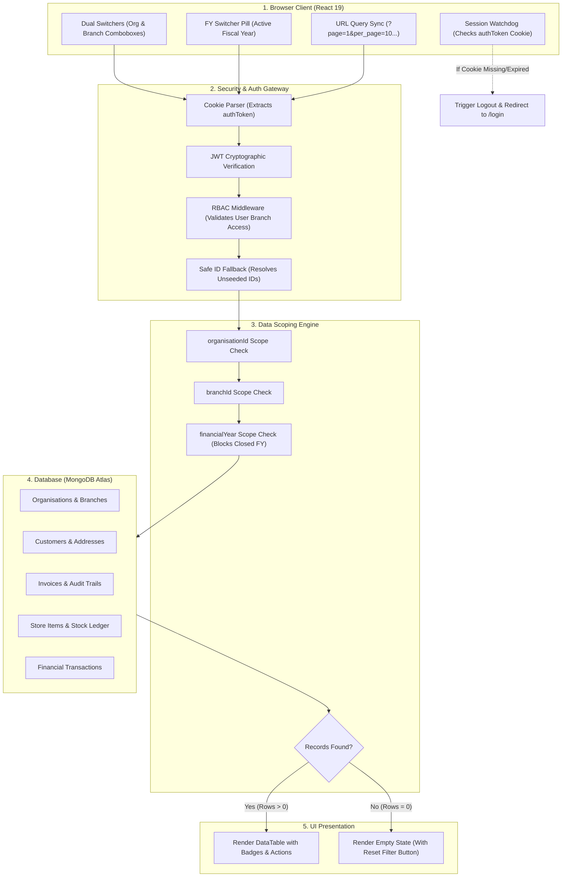

# Smart ERP

A full-stack multi-tenant ERP application built with React 19, Node.js, Express, TypeScript, and MongoDB.

<p align="center">
  
</p>

---

## Overview

I built Smart ERP to handle day-to-day operations for manufacturing, assembly, and distribution businesses. The core requirement was building a multi-tenant system that allows managing multiple organisations and physical branches without mixing up operational data, inventory, or financial books.

Every transactional record (Invoices, Bills, Purchase Orders, Store Movements, Delivery Challans, Ledger Entries) is strictly partitioned across three core dimensions:
- **Organisation**: Top-level company or legal entity (e.g., Smart Enterprise, Global Technologies).
- **Branch**: Operating plant, warehouse, or regional depot (e.g., Chennai Central HQ, Coimbatore Unit, Bengaluru Depot).
- **Financial Year**: Accounting fiscal period (e.g., 2026-2027) with active/closed status controls to prevent backdated edits on closed books.

The user interface keeps search terms, filters, sorting, and pagination synced with URL query parameters (`?page=1&per_page=10...`) so bookmarked and shared links keep exact view state.

---

## Core System Architecture & Features

### 1. Multi-Organisation & Multi-Branch Management
- Users can create, update, and manage multiple organisations via `/organisations` and physical branches via `/branches`.
- Dual switchers in the top navigation bar let administrators switch between companies and branches on the fly.
- When switching branches, all views and summary cards update immediately to reflect that specific facility's records.

### 2. Customer Lifecycle & Single-Active Address History
- Dedicated full-page route at `/customers/:id` (replacing popup modals for customer management).
- **Single-Active Address Policy**: A customer can have only one active Billing address and one active Shipping address at any time.
- **Automated Archiving**: Adding a new address archives previous addresses into an audit history table.
- **One-Click Reactivation**: Users can reactivate any historical address from the timeline, automatically archiving the currently active one.
- **Customer Document Ledger**: Embedded invoice history table with real-time search, sorting, pagination, and multi-format export (CSV and PDF).

### 3. Direct Tax Invoicing & Dynamic GST Calculation
- Full invoice creation (`/invoices/new`) and editing (`/invoices/:id/edit`).
- Replaced native select inputs with searchable, keyboard-friendly `Combobox` components for Customers, Billed-To addresses, Shipped-To addresses, Products, and Bank Accounts.
- **Dynamic Place of Supply & Tax Split**:
  - Selecting an address inspects the customer's state against the branch operating location.
  - **Intra-State (e.g., Tamil Nadu to Tamil Nadu)**: Splits tax into CGST (9%) + SGST (9%).
  - **Inter-State (e.g., Tamil Nadu to Gujarat or Maharashtra)**: Applies full IGST (18%).
  - Freight and transport charges (SAC 9965 @ 18%) recalculate automatically alongside product line items.
- **Custom Bank Details & Terms**: Invoices include inline-editable company bank accounts and custom Terms & Conditions per customer.
- **Payment-Locked Editing**: If an invoice has received any recorded payments (`paidAmount > 0`), editing is blocked to protect historical audit records.

### 4. Financial Transactions Ledger (`/transactions`)
- Central double-entry institutional audit book tracking debits (outflows), credits (inflows), and running account balances.
- **Redesigned Filter Toolbar**:
  - Searchable Comboboxes for Transaction Types (`Customer Payment`, `Vendor Payment`, `Vendor Advance`, `Bank Transfer`, `Ledger Reversal`, `Adjustment`, `Expense`) and Bank Accounts.
  - Quick Date Presets: One-click buttons for `All Time`, `This Month`, `Last 30 Days`, and `Current FY` with active button highlights.
  - Custom `From` and `To` date range picker with instant clear action.
  - Dynamic "Reset Filters" button that appears whenever any filter is active.
- **Clean Table Formatting & Pagination**:
  - Numeric columns formatted with non-breaking monetary badges (`-₹...` debit, `+₹...` credit, `₹...` balance).
  - Status indicators with color-coded status dots (`POSTED`, `REVERSED`).
  - Table pagination footer with record counter, configurable page sizes (`10`, `25`, `50`, `100 / page`), and previous/next page navigation.
- Slide-over transaction drawer detailing party name, reference/UTR number, posting timestamp, and reversal action with mandatory reason logging.

### 5. Procurement & Inventory Pipeline
- **Purchase Order → Vendor Bill Conversion**: Tracks remaining open quantities per line item to prevent over-billing across split deliveries.
- **Warehouse Inward Movements**: Validates batch numbers, warehouse rack/shelf locations, and enforces expiry date rules (must be at least 5 days into the future).
- **Auto-Reorder Triggers**: Tracks minimum reorder thresholds across products and creates reorder alerts for purchasing teams.

### 6. Vector PDF Document Engine
- Generates pixel-accurate vector tax invoices and reports using `@react-pdf/renderer`.
- Clean HSN tax breakdown tables (`HSN/SAC`, `Rate %`, `Taxable Value`, `CGST`, `SGST`, `Total Tax`) without broken characters or formatting artifacts.

---

## Request & Scoping Pipeline

The pipeline below shows how an HTTP request moves from the browser through authentication, tenant scoping, and database execution:



### Detailed Execution Steps

1. **Frontend Context Initialization**:
   - The user selects their active **Organisation**, **Branch**, and **Financial Year** using the top header controls.
   - These selections are stored in Zustand (`erpStore.ts`) and cached in `localStorage` strictly for UI continuity (never storing authentication tokens).
   - The `useUrlTableState` hook keeps search terms, filters, sorting columns, and pagination offsets synchronized with the browser address bar.

2. **Strict HttpOnly Cookie Authentication**:
   - The browser automatically attaches the `authToken` HttpOnly cookie to every request (`SameSite=Lax`, `Path=/`).
   - A client-side watchdog runs in the background. If the session cookie expires or is cleared, the frontend detects it and redirects the user to `/login` immediately.

3. **Security Gateway & Access Control**:
   - `authMiddleware.ts` extracts the signed cookie and verifies the JWT payload.
   - The user's role assignments are verified against the target branch and organisation to prevent horizontal privilege escalation.
   - If an unseeded or legacy branch ID is encountered in older records, the fallback resolver maps it to the primary branch ID so data queries do not fail.

4. **Multi-Tenant Data Scoping**:
   - The backend query builder injects tenant isolation filters into every Mongoose query:
     - `organisationId`: Enforces hard tenant boundary.
     - `branchId`: Restricts records to the active plant, branch, or depot.
     - `financialYear`: Restricts accounting transactions to the selected fiscal year.
   - If the selected fiscal year has status `Closed`, write and edit operations (such as creating new invoices or posting ledger adjustments) are rejected with a `403 Forbidden` response.

5. **Database Execution & Zero-Record Handling**:
   - MongoDB queries execute against collections indexed by `{ organisationId: 1, branchId: 1, financialYear: 1 }`.
   - When a newly created branch or historical year returns zero records, the backend responds with a clean empty structure.
   - The UI intercepts empty datasets and renders a clean empty state card with quick actions ("Clear filters" or "Switch branch") instead of breaking the table layout.

---

## Database Schema Overview

Core Mongoose models defined in `server/src/models/ErpModels.ts`:

| Model | Primary Fields | Tenant & Scoping Keys |
| :--- | :--- | :--- |
| **`Organisation`** | `name`, `code`, `currency`, `taxIdentifier`, `address` | Root tenant entity |
| **`Branch`** | `organisationId`, `branchCode`, `branchName`, `city`, `address` | Scoped by organisation |
| **`FinancialYear`** | `yearName`, `startDate`, `endDate`, `isCurrent`, `status` | Scoped by organisation |
| **`UserAccount`** | `name`, `email`, `mobile`, `passwordHash`, `roles: IUserRole[]` | Multi-branch role mapping |
| **`Customer`** | `name`, `customerCode`, `companyName`, `gstin`, `creditLimit`, `addresses: ICustomerAddress[]` | Scoped by branch & organisation |
| **`Vendor`** | `name`, `vendorCode`, `companyName`, `gstin`, `paymentTerms`, `creditLimit` | Scoped by branch & organisation |
| **`Product`** | `name`, `itemCode`, `hsnCode`, `unitPrice`, `minReorderLevel`, `unit` | Scoped by branch & organisation |
| **`PurchaseOrder`** | `poNumber`, `vendorId`, `items`, `subTotal`, `taxTotal`, `grandTotal`, `status` | Scoped by branch, org, & FY |
| **`Bill`** | `billNumber`, `vendorId`, `purchaseOrderId`, `items`, `paidAmount`, `status` | Scoped by branch, org, & FY |
| **`Invoice`** | `invoiceNumber`, `customerId`, `items`, `billedToAddress`, `shippedToAddress`, `bankDetails`, `termsAndConditions`, `auditTrail` | Scoped by branch, org, & FY |
| **`StoreItem`** | `productId`, `quantity`, `batchNumber`, `expiryDate`, `warehouseLocation` | Scoped by branch & organisation |
| **`DeliveryChallan`**| `challanNumber`, `invoiceId`, `vehicleNumber`, `dispatchDate`, `status` | Scoped by branch, org, & FY |
| **`BankAccount`** | `accountNumber`, `bankName`, `ifscCode`, `branchName`, `openingBalance`, `isPrimary` | Scoped by organisation |
| **`FinancialTransaction`** | `transactionNumber`, `bankAccountId`, `type`, `debit`, `credit`, `runningBalance`, `status` | Scoped by organisation & branch |

---

## Session & Token Architecture

```
+-------------------------------------------------------------------------+
|                       HTTP COOKIE STORAGE                               |
|                       Cookie: authToken=<JWT>                           |
|                       Path=/; SameSite=Lax; HttpOnly                    |
+-------------------------------------------------------------------------+
                                    ▲
                                    │ (Verified automatically by Express)
+-----------------------------------+-------------------------------------+
|                      CLIENT-SIDE LOCAL STORAGE                          |
|  [ALLOWED] Safe UI Preferences:                                         |
|    - UserID: "67d2e..."           (Non-sensitive identifier)           |
|    - userName: "Jay Raam"         (Display name for greeting)           |
|    - userType: "SuperAdmin"       (UI permission check metadata)        |
|    - activeOrgId: "6aa79..."      (Currently selected organisation)     |
|    - Branch: "67d2..."            (Currently selected branch ID)        |
|    - BranchName: "Chennai HQ"     (Current branch label)                |
|    - FinancialYear: "2026-2027"   (Current active fiscal year)          |
|                                                                         |
|  [FORBIDDEN] Auth tokens are never stored in localStorage/sessionStorage|
+-------------------------------------------------------------------------+
```

---

## API Reference

### Organisation & Branch Setup
- `GET /api/erp/organisations` — List organisations accessible to the user.
- `POST /api/erp/organisations` — Create a new tenant organisation.
- `GET /api/erp/branches` — List branches scoped to active organisation.
- `POST /api/erp/branches` — Add a new operating branch or plant.

### Authentication & Bootstrap
- `POST /api/erp/auth/login` — Verifies user credentials, sets signed `authToken` cookie, returns profile info.
- `GET /api/erp/auth/me` — Validates current cookie session and hydrates in-memory store.
- `POST /api/erp/auth/logout` — Clears the `authToken` cookie.
- `GET /api/erp/bootstrap` — Hydrates organisations, branches, fiscal years, and branch-scoped master records.

### Customer Management & Addresses
- `GET /api/erp/customers` — Lists customers for the active branch.
- `GET /api/erp/customers/:id` — Full customer detail profile, balances, and address history.
- `POST /api/erp/customers/:id/addresses` — Adds new address with automatic single-active archiving.
- `POST /api/erp/customers/:id/addresses/:addressId/activate` — Reactivates a historical address.
- `PUT /api/erp/customers/:id/addresses/:addressId` — Edits address fields.

### Tax Invoices
- `GET /api/erp/invoices` — Lists tax invoices scoped to branch and fiscal year.
- `POST /api/erp/invoices` — Creates tax invoice, records place of supply, and initializes audit trail.
- `PUT /api/erp/invoices/:id` — Edits unpaid tax invoice (blocked if `paidAmount > 0`).
- `GET /api/erp/invoices/:id/history` — Returns complete invoice lifecycle events.

### Payments & Banking Ledger
- `POST /api/erp/payments` — Records customer or vendor payment and creates immutable ledger transaction.
- `GET /api/erp/transactions` — Queries financial ledger with type, bank, date range, and search filters.
- `POST /api/erp/transactions/:id/reverse` — Creates offsetting reversal transaction entry.

---

## Getting Started

### Prerequisites
- **Node.js**: v18.0 or higher
- **npm**: v9.0 or higher
- **MongoDB**: Local MongoDB instance or MongoDB Atlas URI

### 1. Clone the Repository
```bash
git clone https://github.com/Jay-Raam/Smart-ERP.git
cd Smart-ERP
```

### 2. Configure Environment Variables
Create a `.env` file in the `server/` directory:
```env
PORT=4000
MONGODB_URI=mongodb+srv://<username>:<password>@<cluster>.mongodb.net/smart_erp?retryWrites=true&w=majority
JWT_SECRET=your_jwt_secret_key_here
COOKIE_SECRET=your_cookie_signing_secret_here
NODE_ENV=development
```

### 3. Install Dependencies
```bash
# Installs root, client, and server dependencies
npm run install:all
```

### 4. Seed Development Data
Seed demo manufacturing records (organisations, branches, products, customers, vendors, and initial ledger balances):
```bash
cd server
npm run seed
```

### 5. Run Development Servers
```bash
# From repository root (runs server on 4000 and Vite client on 5173 concurrently)
npm run dev
```

Open `http://localhost:5173` in your browser.

---

## Tech Stack

- **Frontend**: React 19, TypeScript, Vite, Tailwind CSS, Zustand, Lucide React, `@react-pdf/renderer`
- **Backend**: Node.js, Express, TypeScript, Mongoose (MongoDB)
- **Authentication**: JWT via HttpOnly Cookies, Role-Based Access Control (RBAC)
- **Reporting**: Native vector PDF generator and RFC-4180 CSV exporter

---

<p align="center">
  <b>Smart Enterprise ERP</b> — Built for multi-tenant manufacturing, billing, and operational tracking.
</p>
