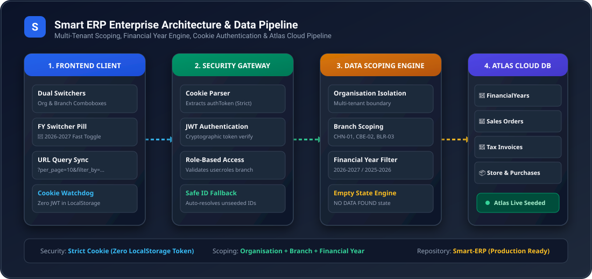
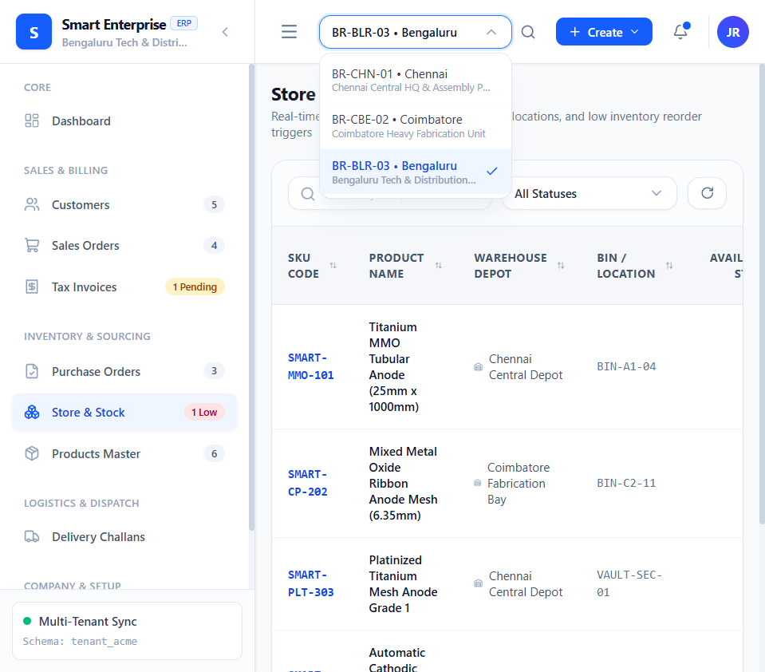
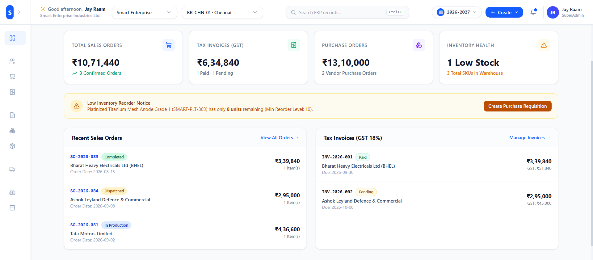
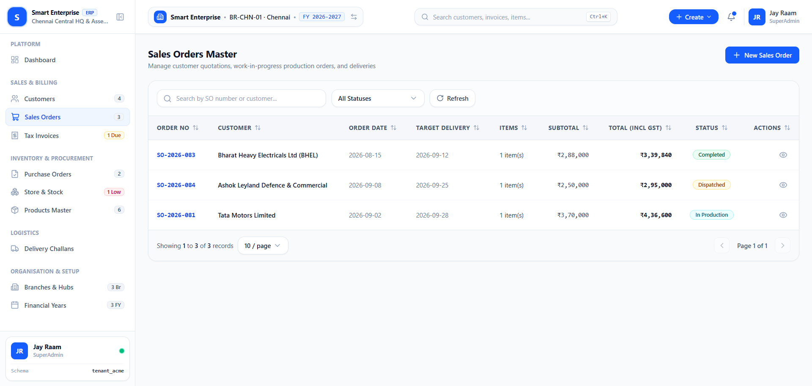
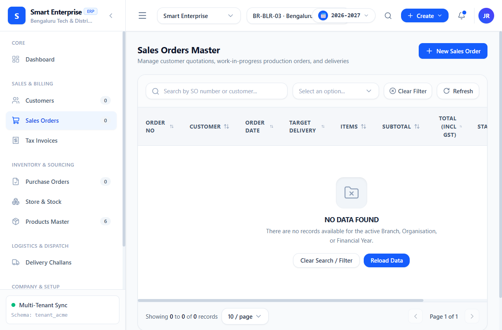
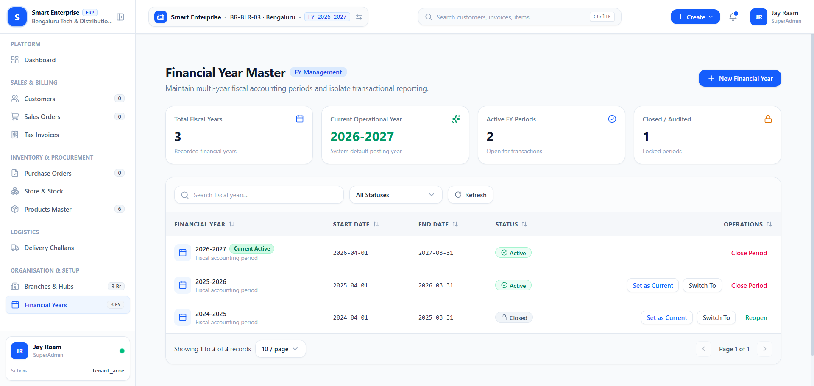
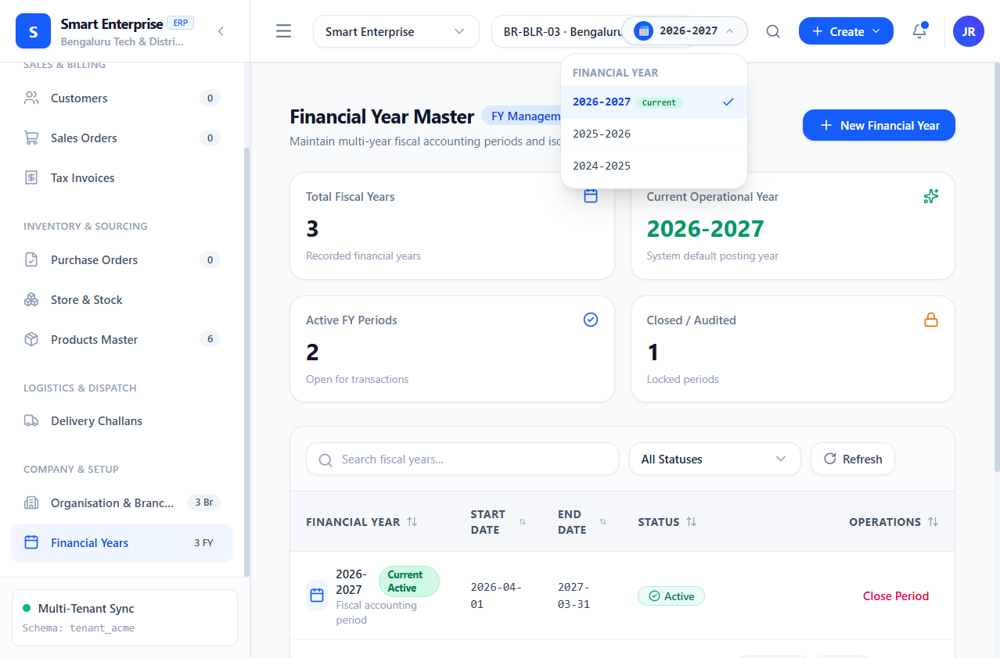
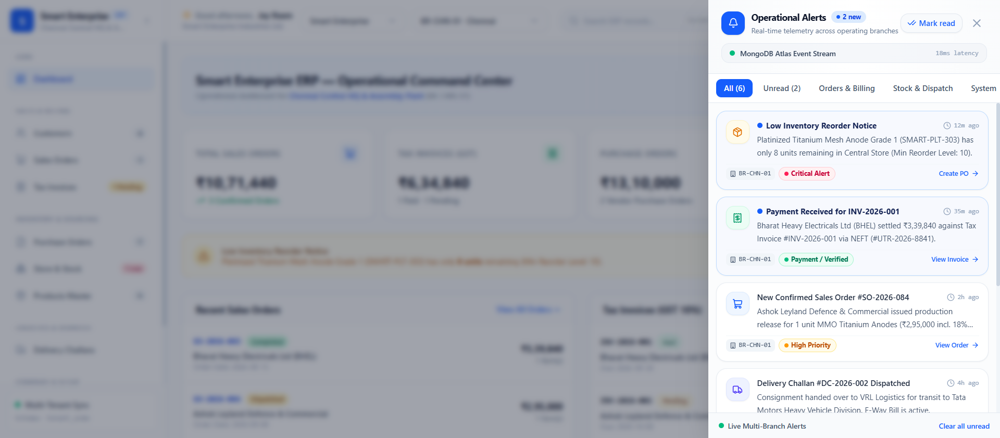
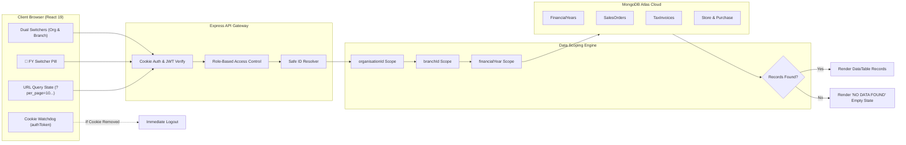

# 🏢 Smart Enterprise ERP

<p align="center">
  
</p>

<p align="center">
  
  
  
  
  
  
</p>

---

## 📖 Executive Summary

**Smart Enterprise ERP** is a modern, full-stack multi-tenant manufacturing and resource planning platform built for precision engineering, heavy manufacturing, and industrial distribution.

The system features **three-dimensional data isolation** across **Organisation**, **Operating Branch**, and **Financial Year**, ensuring every transaction, ledger entry, stock movement, and customer balance is strictly partitioned while allowing executives seamless switching between multi-branch entities and accounting periods.

---

## 🎯 Key Architectural Pillars

1. **Strict Multi-Tenant & Multi-Branch Scoping**: All transactional entities (Customers, Sales Orders, Tax Invoices, Purchase Orders, Store Inventory, Delivery Challans) are isolated by the triad: `organisationId` + `branchId` + `financialYear`.
2. **Dedicated Financial Year Master**: Multi-year fiscal accounting management supporting active, closed, and current operating years with period locking and period transitions.
3. **URL-Synchronized Table State Engine (`useUrlTableState`)**: Every search keyword, status filter (`filter_by=status.<val>`), sort column, sort order, page number, and page size are bidirectionally bound to browser URL query parameters.
4. **Intelligent "NO DATA FOUND" Empty States**: When switching to a newly opened branch or a closed historical year with zero records, the interface dynamically displays a dedicated empty state with clear guidance, one-click filter resets, and manual data reload triggers.
5. **Zero Token in LocalStorage**: Authentication tokens are strictly transmitted and verified through secure cookies (`authToken`). Non-sensitive operational metadata (`Branch`, `BranchName`, `OrganizationId`, `FinancialYear`, `UserID`, `userName`) resides in `localStorage` for UI continuity, but grants zero system access without the cookie.
6. **Real-World MongoDB Atlas Cloud Database**: Seeded with real industrial manufacturing data including Cathodic Protection MMO Anodes, Platinized Titanium Substrates, and genuine enterprise clients (BHEL, Ashok Leyland, Tata Motors, L&T).

---

## 🖼️ System Walkthrough & Visual Results

### 1. Streamlined Authentication (Cookie-Only Security)
The login portal requires only **Email or Mobile Number** and **Password**. It establishes a secure session via the `authToken` cookie and initializes the user's permitted role assignments across operating branches.



---

### 2. Executive Management Dashboard
Live telemetry dashboard displaying real-time branch revenue, sales order status breakdowns, GST invoice calculations, purchase requisitions, and inventory reorder alerts tailored to the currently active branch and fiscal year.



---

### 3. Scoped Sales Orders & Transactional Grid
Interactive DataTable featuring live search, status filters (`Completed`, `Dispatched`, `In Production`), date tracking, and total calculations with 18% GST breakdown.



---

### 4. Intelligent Empty State ("NO DATA FOUND")
When a branch with zero records (e.g., Bengaluru Tech & Distribution Depot `BR-BLR-03`) or a closed historical fiscal year is selected, the UI gracefully renders a clean empty state with one-click filter resets and data reloads.



---

### 5. Financial Year Master Management
The dedicated Financial Year Master module provides comprehensive accounting period controls:
- **KPI Summary Cards**: Total Recorded Fiscal Years, Current Operational Year, Active FY Periods, and Closed/Audited Periods.
- **Period Operations**: **Set as Current**, **Close Period** (locks transactions), and **Reopen Period**.
- **New Financial Year Creation**: Modal with full date-range validation and accounting year designation.



---

### 6. Dual Combobox Switchers & Financial Year Switcher Pill
- **Organisation Combobox**: Switch enterprise tenant organizations.
- **Branch Combobox**: Filtered strictly to branches permitted by the authenticated user's assigned roles (`user.roles`).
- **Financial Year Switcher (`📅 2026-2027`)**: Top-bar calendar pill with an animated dropdown menu to switch accounting periods with a single click.



---

### 7. Real-Time Operations & Alert Center (Notification Drawer)
Modern slide-over notification hub providing live multi-branch telemetry, categorized alert filtering (`All`, `Unread`, `Orders & Billing`, `Stock & Dispatch`, `System`), priority chips (`Critical Alert`, `Payment Verified`, `High Priority`), and direct one-click workflow navigation (`Create PO`, `View Invoice`, `View Order`).



---

## 🔄 End-to-End Request & Scoping Pipeline



---

## 🗄️ Multi-Tenant Database Architecture

### Data Models (`server/src/models/ErpModels.ts`)

| Model | Key Fields | Multi-Tenant Scope |
| :--- | :--- | :--- |
| **`Organisation`** | `name`, `code`, `currency`, `taxIdentifier` | Root multi-tenant entity |
| **`Branch`** | `organisationId`, `branchCode`, `branchName`, `city`, `address` | Sub-tenant operating location |
| **`FinancialYear`** | `yearName`, `startDate`, `endDate`, `isCurrent`, `status`, `organisationId` | Fiscal accounting periods |
| **`UserAccount`** | `name`, `email`, `mobile`, `passwordHash`, `roles: IUserRole[]` | Multi-branch role assignments |
| **`Customer`** | `name`, `customerCode`, `company`, `gstin`, `creditLimit`, `branchId` | Scoped by branch & org |
| **`SalesOrder`** | `soNumber`, `customerId`, `branchId`, `financialYear`, `items`, `status` | Scoped by branch, org, & FY |
| **`Invoice`** | `invoiceNumber`, `salesOrderId`, `branchId`, `financialYear`, `amount`, `gst` | Scoped by branch, org, & FY |
| **`PurchaseOrder`** | `poNumber`, `vendorName`, `branchId`, `financialYear`, `totalAmount` | Scoped by branch, org, & FY |
| **`StoreItem`** | `itemCode`, `itemName`, `branchId`, `quantity`, `minReorderLevel` | Scoped by branch & org |
| **`DeliveryChallan`** | `dcNumber`, `salesOrderId`, `branchId`, `financialYear`, `status` | Scoped by branch, org, & FY |

---

## 🔐 Security & Session Protocol

```
+-------------------------------------------------------------------------+
|                       HTTP COOKIE STORAGE ONLY                          |
|                       Cookie: authToken=<JWT>                           |
|                       Path=/; SameSite=Lax                              |
+-------------------------------------------------------------------------+
                                    ▲
                                    │ (Checked every turn)
+-----------------------------------+-------------------------------------+
|                      CLIENT-SIDE STORAGE AUDIT                          |
|  [ALLOWED] localStorage:                                                |
|    - UserID: "67d2e..."           (Non-sensitive identifier)           |
|    - userName: "Jay Raam"         (Display string)                      |
|    - userType: "SuperAdmin"       (UI display metadata)                 |
|    - Branch: "67d2..."            (Current branch ID)                   |
|    - BranchName: "Chennai HQ"     (Current branch label)                |
|    - FinancialYear: "2026-2027"   (Current active fiscal year)          |
|                                                                         |
|  [FORBIDDEN] localStorage.getItem('token') === NULL (Never stored!)     |
+-------------------------------------------------------------------------+
```

---

## 📡 API Endpoint Reference

### Multi-Tenant Bootstrap & Core
- `GET /api/erp/bootstrap` — Fetches scoped organization metadata, active branches, financial years, customers, orders, invoices, inventory, and purchase records based on `organisationId`, `branchId`, and `financialYear`.

### Authentication & Profile
- `POST /api/erp/auth/login` — Verifies email/mobile + password, issues `authToken` cookie, returns non-sensitive user profile with `roles: IUserRole[]`.
- `GET /api/erp/auth/me` — Reads `authToken` cookie and returns authenticated session metadata.
- `POST /api/erp/auth/logout` — Clears `authToken` cookie and terminates session.

### Financial Year Master
- `GET /api/erp/financial-years` — Lists all fiscal years for the organization.
- `POST /api/erp/financial-years` — Creates a new fiscal accounting period.
- `PATCH /api/erp/financial-years/:id` — Updates period status (`Active` / `Closed`) or sets as system current year.

---

## ⚙️ Quick Start & Installation

### Prerequisites
- **Node.js**: v18.0 or higher
- **npm**: v9.0 or higher
- **MongoDB**: MongoDB Atlas connection URI or local MongoDB instance

### 1. Clone the Repository
```bash
git clone https://github.com/Jay-Raam/Smart-ERP.git
cd Smart-ERP
```

### 2. Configure Environment Variables
Create a `.env` file in `server/`:
```env
PORT=4000
MONGODB_URI=mongodb+srv://<username>:<password>@<cluster>.mongodb.net/smart_erp?retryWrites=true&w=majority
JWT_SECRET=your_super_secret_jwt_key_here
COOKIE_SECRET=your_cookie_signing_secret_here
NODE_ENV=development
```

### 3. Install Dependencies
```bash
# Install root, backend, and frontend packages
npm run install:all
```

### 4. Seed Real Industrial Data
```bash
cd server
npm run seed
```

### 5. Start Development Servers
```bash
# Start backend API (Port 4000) and frontend Vite dev server (Port 5173) concurrently:
npm run dev
```

Visit `http://localhost:5173` in your browser.

---

## 🧪 Default Test Credentials

| Full Name | Role | Email | Password | Branch Access |
| :--- | :--- | :--- | :--- | :--- |
| **Jay Raam** | SuperAdmin | `jayraam@smarterp.in` | `Smart@2026` | Chennai HQ, Coimbatore, Bengaluru (All) |
| **Priya Sharma** | Branch Manager | `priya.s@smarterp.in` | `Smart@2026` | Coimbatore Heavy Fabrication Unit |

---

## 🛠️ Developer Workflow & Git Standards

This repository strictly enforces professional engineering workflow guidelines governed by [AGENTS.md](AGENTS.md) and [.agents/skills/professional-git-workflow](.agents/skills/professional-git-workflow/SKILL.md):

- **Dedicated Branches**: All development occurs on isolated branches (`feature/*`, `fix/*`, `refactor/*`, `chore/*`).
- **Imperative Commit Messages**: Authentic, human-written messages (`Add ...`, `Fix ...`, `Update ...`, `Refactor ...`).
- **Milestone History**: Changes are broken down into logical engineering milestones (Implementation $\rightarrow$ Validation $\rightarrow$ Edge Cases $\rightarrow$ API Refactor $\rightarrow$ Testing).
- **Pre-Push Review**: Automatic validation ensuring `npm run build` passes, zero secrets or `.env` files are committed, and tests pass before remote pushes.

---

<p align="center">
  <b>Smart Enterprise ERP</b> ✦ Engineered for Precision Manufacturing &amp; Multi-Branch Excellence.
</p>
